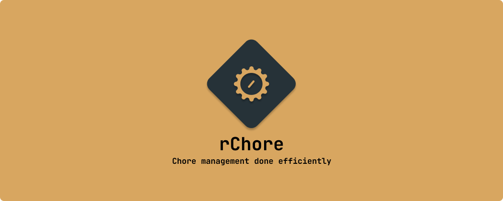
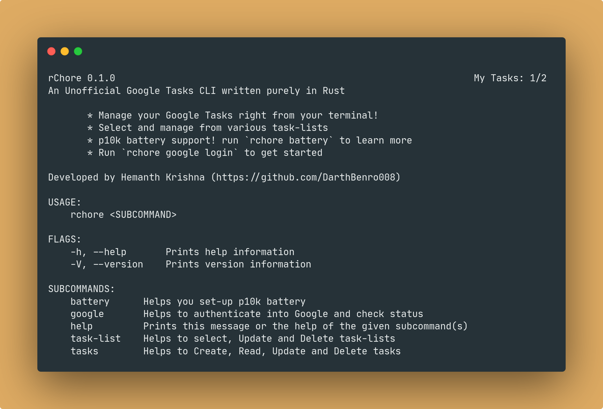
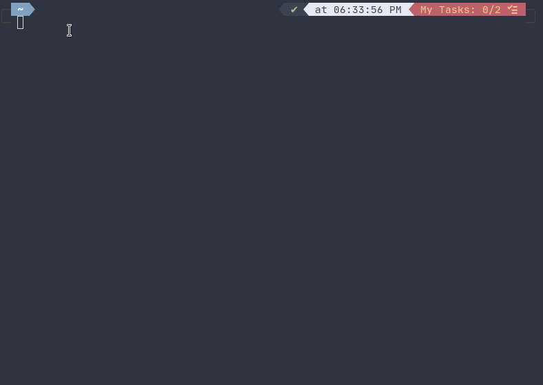
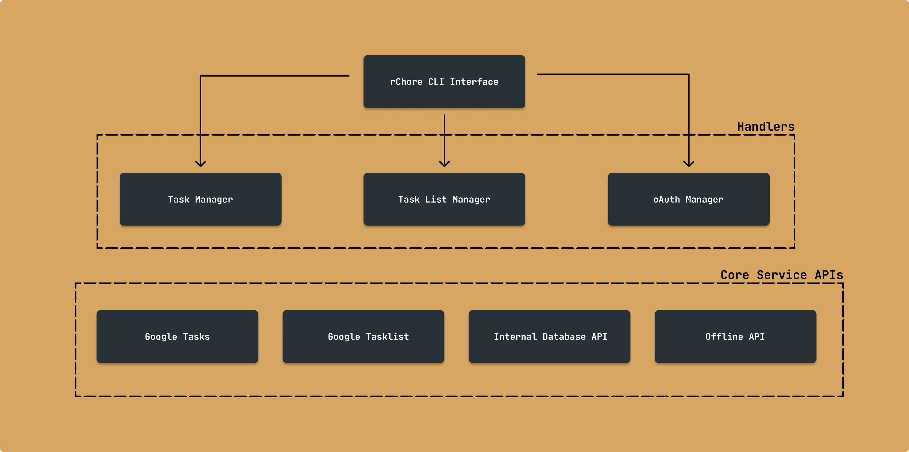

[](https://github.com/aryan9600/cowin-notifier/blob/master/LICENSE)
[](https://github.com/aryan9600/cowin-notifier/issues/new/choose)

# rChore

> A feature packed unofficial Google Tasks CLI to boost your producitvity, written purely in Rust.

## 🤔 What is rChore?

rChore is an unofficial Google Tasks CLI, it can help you manage various tasks right from your terminal, it also comes with a [powerlevel10k battery](https://github.com/romkatv/powerlevel10k#extremely-customizable) support to boost your producivity!

Primary features of rChore are:

- Single command login and logout
- Auto obtain access token, login only once!
- Create, Check, Update and Delete your tasks
- Switch between task-lists and ability to create, update, and, delete task-lists.
- p10k battery support that boosts your productivity!

## 💻 Usage



- After installing the binary, you can run it from anywhere by typing `rchore`
- To get started with rChore, you need to login first, you can do this by typing `rchore google login`
- A link will be prompt, copy it and open it in your browser, you will be redirected to Google login page.
- You can then use the various commands to manage your tasks, for example `rchore tasks list`, `rchore tasks add`, `rchore tasks done <task index>`, `rchore tasks delete <task index>`
- you can pass the `-h` flag to know more about a command, feel free to open an issue if you have any questions.

### Powerlevel10k battery support



## ⬇ Installation

### Cargo

If you have cargo installed, you can install rChore using cargo with the following command.

```bash
cargo install rchore
```

### Manual Installation

You can also download the binary and install it manually.

- Go to [releases page](https://github.com/DarthBenro008/rchore/releases) and grab the latest release of rChore.
- Download the latest release of rChore specific to your OS.
- If you are on Linux/MacOS, make sure you move the binary to somewhere in your `$PATH` (e.g. `/usr/local/bin`).

### Powerlevel10k Battery Support

If you use powerlevel10k, you can type `rchore battery` to get help on installing the battery.

- Open .p10k.zsh file in your favorite editor.
- Copy the function from `rchore battery` and append it to your .p10k.zsh file
- Add rchore to either `POWERLEVEL9K_RIGHT_PROMPT_ELEMENTS` or `POWERLEVEL9K_LEFT_PROMPT_ELEMENTS`
  
  ```bash
    typeset -g POWERLEVEL9K_RIGHT_PROMPT_ELEMENTS=(
    # =========================[ Line #1 ]=========================
    ...      
    rchore
  )
  ````

## 🛠 Architecture and Structure



## ⭐ Show your support

Give a ⭐ if you liked this project!

Spread the word to your fellows to boost producitivity for everyone!

## 🤝 Contributions

- Feel Free to Open a PR/Issue for any feature or bug(s).
- Make sure you follow the [community guidelines](https://docs.github.com/en/github/site-policy/github-community-guidelines) and read [CONTRIBUTIONS.md](https://github.com/DarthBenro008/rchore/CONTRIBUTIONS.md)!
- Feel free to open an issue to ask a question/discuss anything about rChore.
- Have a feature request? Open an Issue!

## ⚖ License

Copyright 2021 Hemanth Krishna

Licensed under MIT License : https://opensource.org/licenses/MIT

<p align="center">Made with ❤ and multiple cups of coffee</p>
